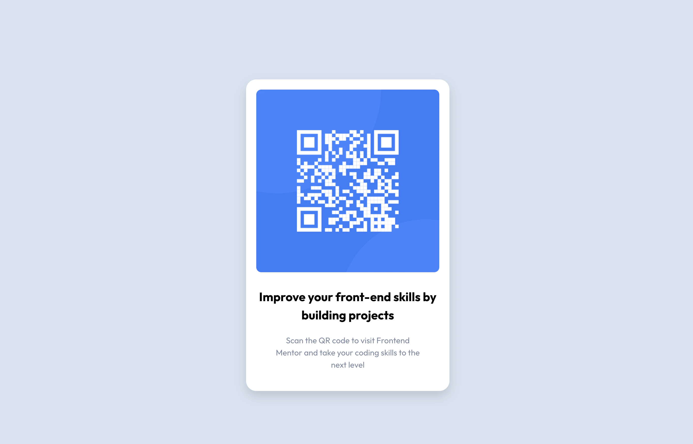
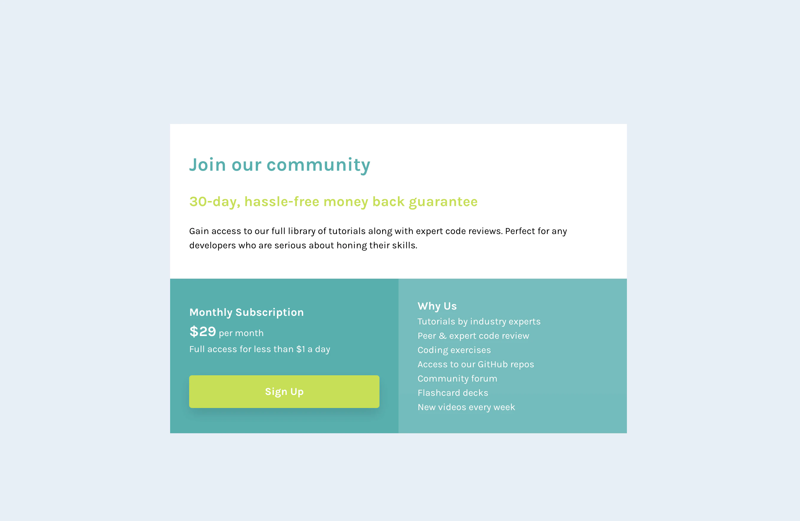
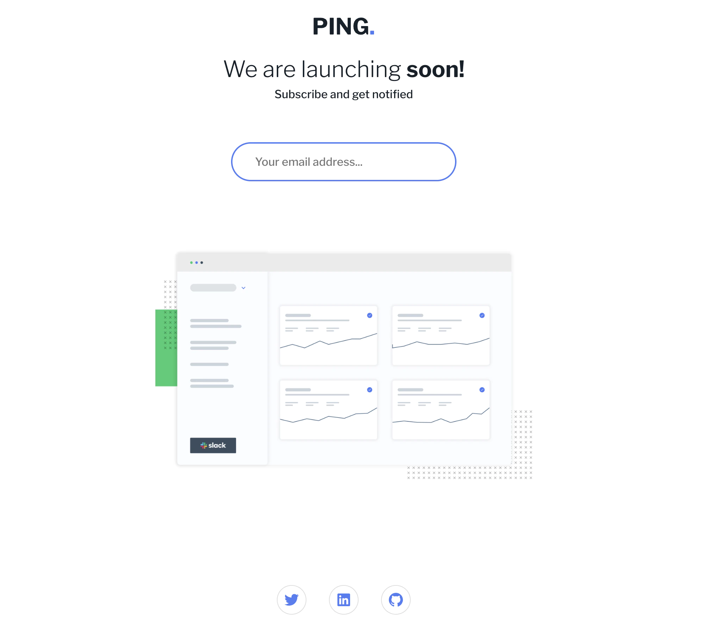
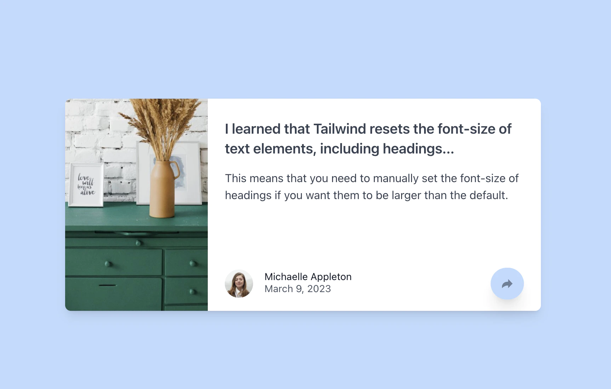

# Frontend Mentor

My solutions to various challenges from [Frontend Mentor](https://www.frontendmentor.io/).
My purpose for this project is to learn more about SolidJS and to practice my CSS skills.
I want to learn more about different tools and technoligies for implementing CSS like TailwindCSS, CSS Modules, and CSS in JS.

If you're looking at the structure of the project, you might notice that I have most of my components organized into their own folders with an `index.tsx` file. This is called a [barrel](https://youtu.be/b0IZo2Aho9Y?t=223). I like to use this pattern because it makes it easier to import components from other files. It also makes the file strucutre look cleaner IMO.

Site is deployed for free on Netlify! <https://solid-mentor.netlify.app>

## ✅ Getting Started

### ⚛️ Dependencies, Prerequisites, and Installation

* [NodeJS](https://nodejs.org/en/)
* [Pnpm](https://pnpm.io/)
* [Vite](https://vitejs.dev/)
* [Typescript](https://www.typescriptlang.org/)
* [SolidJS](https://www.solidjs.com/)
* [Solid Router](https://github.com/solidjs/solid-router)

1. Clone the repo
1. Install dependencies with `pnpm install`. Regular npm should also work.
1. Run `pnpm dev` to start the dev server.

## 🥊 Completed and In-Progress Challenges

* ~~[QR Code Component](https://github.com/Brian-Pob/frontend-mentor/tree/master/src/Challenges/QRCodeComponent)~~

* ~~[Order Summary Component](https://github.com/Brian-Pob/frontend-mentor/tree/master/src/Challenges/OrderSummaryComponent)~~

* ~~[Single Price Grid Component](https://github.com/Brian-Pob/frontend-mentor/tree/master/src/Challenges/SinglePriceGridComponent)~~

* ~~[Ping Coming Soon Page](https://github.com/Brian-Pob/frontend-mentor/tree/master/src/Challenges/PingComingSoonPage)~~

* ~~[Article Preview Component](https://cheerful-pastelito-dd1736.netlify.app/)~~

* ~~[Age Calculator](https://github.com/Brian-Pob/frontend-mentor/tree/master/src/Challenges/AgeCalculator)~~

* [Testimonials Grid - In Progress](https://github.com/Brian-Pob/frontend-mentor/tree/master/src/Challenges/TestimonialsGrid)

## 🧑‍💻 Authors

* Me - [Github](https://github.com/Brian-Pob) - [Twitter](https://twitter.com/brianmpdotdev) - [LinkedIn](https://www.linkedin.com/in/Brian-Pob/)

## 🪪 License

Whatever Frontend Mentor uses lol.

## 👏 Acknowledgments

* README template from [DomPizzie](https://gist.github.com/DomPizzie/7a5ff55ffa9081f2de27c315f5018afc)
