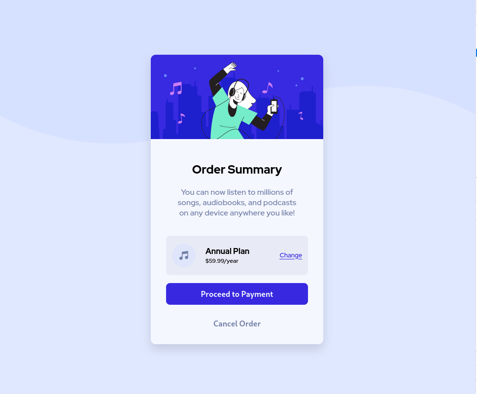
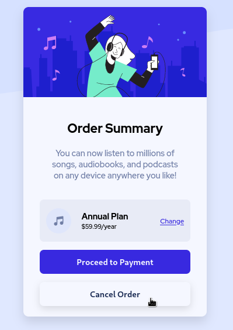

# Frontend Mentor - Order summary card solution

This is a solution to the [Order summary card challenge on Frontend Mentor](https://www.frontendmentor.io/challenges/order-summary-component-QlPmajDUj). Frontend Mentor challenges help you improve your coding skills by building realistic projects. 

## Table of contents

- [Overview](#overview)
  - [The challenge](#the-challenge)
  - [Screenshot](#screenshot)
  - [Links](#links)
- [My process](#my-process)
  - [Built with](#built-with)
  - [What I learned](#what-i-learned)
  - [Continued development](#continued-development)
  - [Useful resources](#useful-resources)
- [Author](#author)
- [Acknowledgments](#acknowledgments)

**Note: Delete this note and update the table of contents based on what sections you keep.**

## Overview

### The challenge

Users should be able to:

- See hover states for interactive elements

### Screenshot

Per my friend's suggestion, I started using `rem`s as my units for stuff like padding to make it a bit more responsive.




For hover, I deviated a bit from what the original design calls for. I thought it would look nice if the primary button looked like it was coming out of the page. I accomplished this using the `scale` property and `filter: drop-shadow()`.


I decided not to do the same for the Cancel Order button and just changed the font color and added the drop shadow.




### Links

- Solution URL: [Add solution URL here](https://your-solution-url.com)
- Live Site URL: [Add live site URL here](https://your-live-site-url.com)

## My process

### Built with

- Semantic HTML5 markup
- CSS custom properties
- CSS Grid
- CSS Modules 
- SolidJS
- PNPM
- Vite

### What I learned

For this challenge, I separated my markup into components that were rendered by SolidJS. This allows for reusability of code. I took an Atomic Design approach to structuring my components so that the style and content of a component could be set through props.

In the examples below, assume that each component has access to all its imports and individual styles.
```tsx
// Button Component

const Button: ParentComponent<{ text: string; btnType?: string }> = (props) => {
  if (!props.btnType) {
    props.btnType = 'primary';
  }
  return <button class={styles[props.btnType]}>{props.text}</button>;
};


// Card Component
const Card: ParentComponent<{
  header: string;
  body: string;
  img_url?: string;
}> = (props) => {
  return (
    <div class={styles.cardContainer}>
      <Show when={props.img_url}>
        
      </Show>

      <div class={styles.cardContent}>
        <div class={styles.cardBody}>
          <h2>{props.header}</h2>
          <p>{props.body}</p>
        </div>
        {props.children}
      </div>
    </div>
  );
};


```

### Continued development

I kind of applied the code that I had written for the QR Code challenge here. So this challenge kind of serves as the continued developnent of that project. I may do the same for future projects.

### Useful resources

- [MDN Docs](#)

## Author


## Acknowledgments

