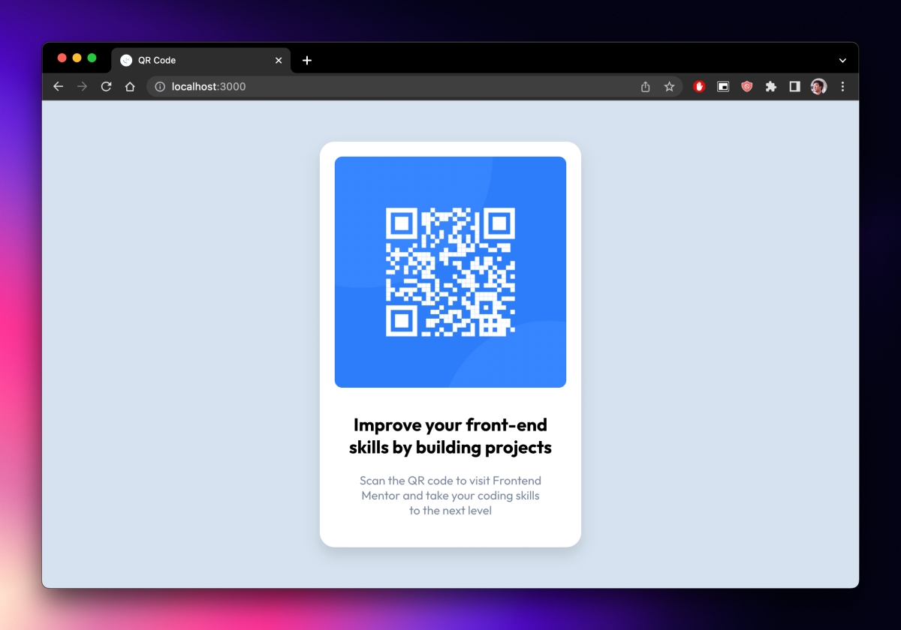

# Frontend Mentor - QR code component solution

This is a solution to the [QR code component challenge on Frontend Mentor](https://www.frontendmentor.io/challenges/qr-code-component-iux_sIO_H). Frontend Mentor challenges help you improve your coding skills by building realistic projects.

## Table of contents

- [Frontend Mentor - QR code component solution](#frontend-mentor---qr-code-component-solution)
  - [Table of contents](#table-of-contents)
  - [Overview](#overview)
    - [Screenshot](#screenshot)
    - [Links](#links)
  - [My process](#my-process)
    - [Built with](#built-with)
    - [Explanation](#explanation)
    - [What I learned](#what-i-learned)
    - [Continued development](#continued-development)
    - [Useful resources](#useful-resources)
  - [Author](#author)
  - [Acknowledgments](#acknowledgments)

## Overview

### Screenshot



### Links

- Solution URL: [Add solution URL here](https://github.com/Brian-Pob/frontend-mentor/tree/master/qr-code-component-main/solution)

## My process

### Built with

- Semantic HTML5 markup
- CSS custom properties
- [Solid](https://solidjs.com/) - JS library
- [Vite](https://vitejs.dev/) - JS bundler
- [PNPM](https://pnpm.io/) - Package manager
- [TypeScript](https://www.typescriptlang.org/) - JS superset

### Explanation

A JS library/ framework like SolidJS and a JS bundler like Vite seem overkill for this project. And you'd be correct. I just wanted to try out a very basic SolidJS app with Vite. I will definitely use SolidJS again for other Frontend Mentor challenges simply because I want to learn it. Same with TypeScript. You could easily get by with just HTML and CSS for this project.

I use pnpm because it's fast and I like it. You can use npm or yarn if you want.

### What I learned

SolidJS with TypeScript is pretty good. At the time of writing this I am just learning TypeScript.

I learned that to use SolidJS components with TypeScript, I need to explicitly define the props type. Also, you can simply use `class` instead of `className` in SolidJS.

```tsx
import {ParentComponent} from 'solid-js';

const CardComponent: ParentComponent<{header: string; body: string}> = (props) => {
  return (
    <div class="card">
      <h2>{props.header}</h2>
    </div>
  );
};
```

Coming from React, I really like Solid because it feels very similar to React but it doesn't have all the unnecessary stuff that React has. I also like that it's very small and fast.

On the topic of styling, I learned that having different border-radius values for a parent component and its children can look pretty nice.

```css
.cardContainer {
  min-height: 50%;
  width: 350px;
  background-color: var(--white);
  border-radius: 20px;
  filter: drop-shadow(0px 10px 10px #00000020);
  text-align: center;
}

.cardImage {
  max-width: 100%;
  border-radius: 10px;
}
```


### Continued development

I like what I've dont for this challenge. I want to expand it a little bit by either creating additional components with this style, utilizing this component in a larger app, or both

### Useful resources

- [SolidJS Docs](https://solidjs.com/guides/typescript) - This is where I learned how to use SolidJS with TypeScript.

## Author

- Me - [Github](https://github.com/Brian-Pob) - [Twitter](https://twitter.com/brianmpdotdev) - [LinkedIn](https://www.linkedin.com/in/Brian-Pob/)

## Acknowledgments
